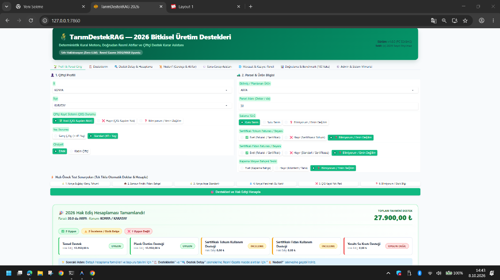
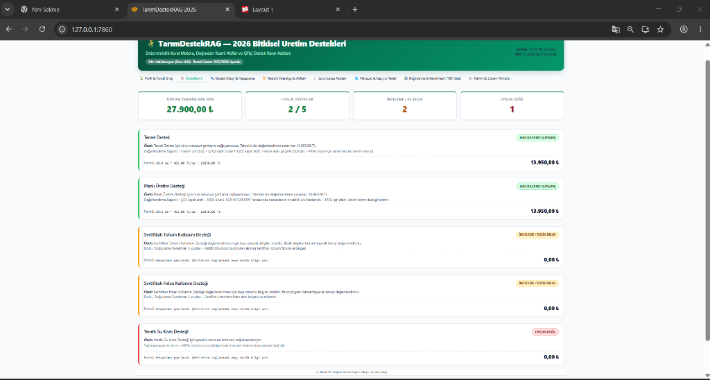
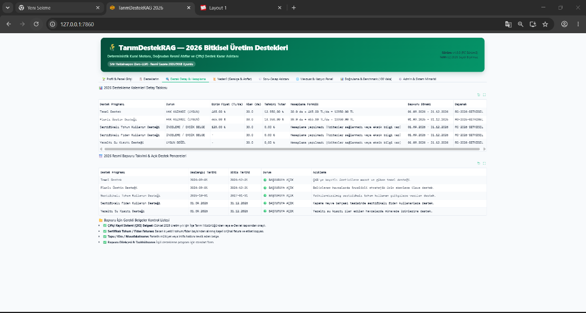
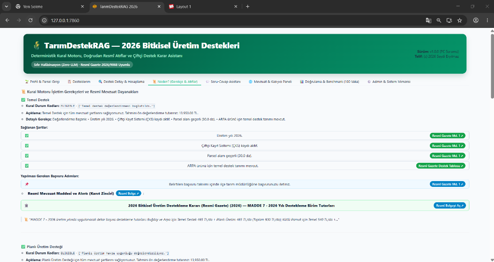
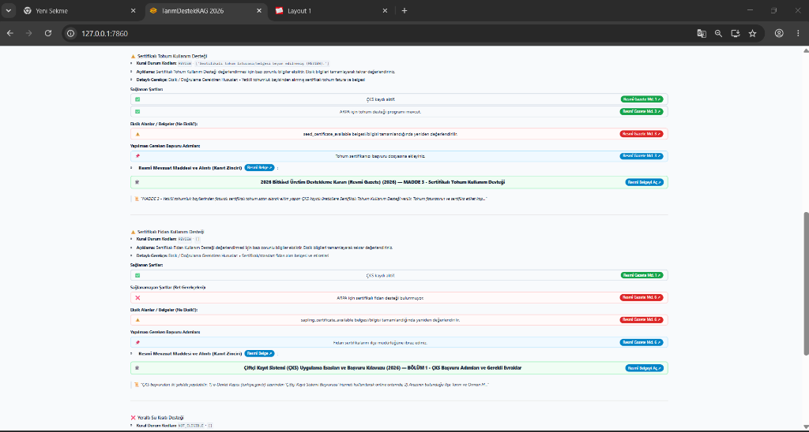
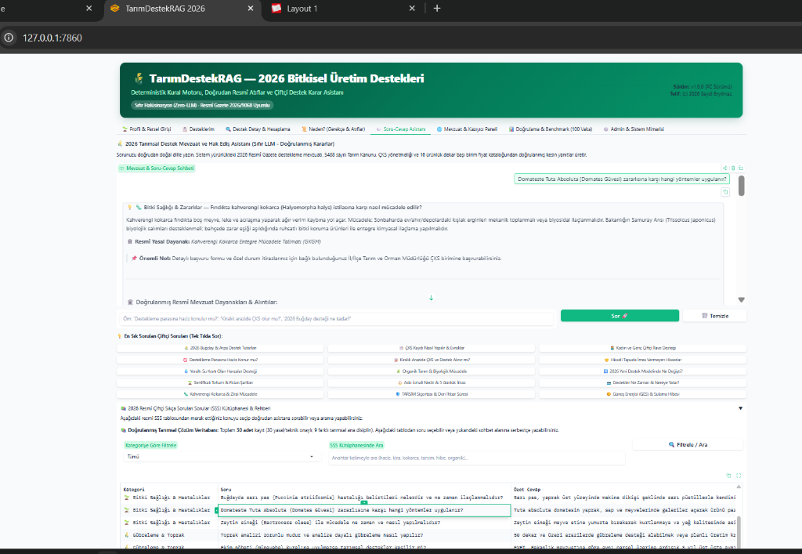
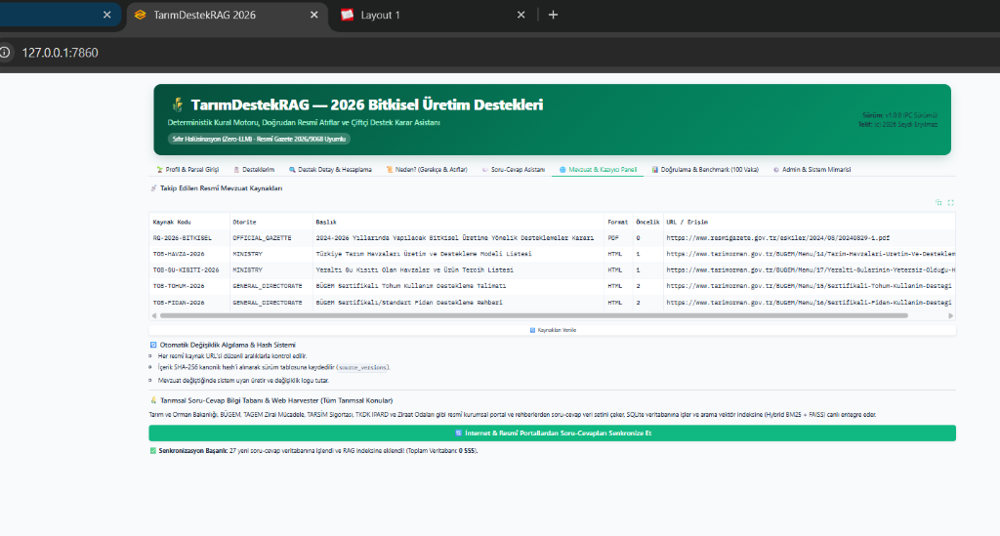
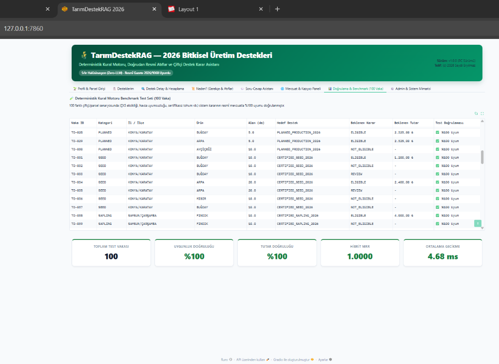
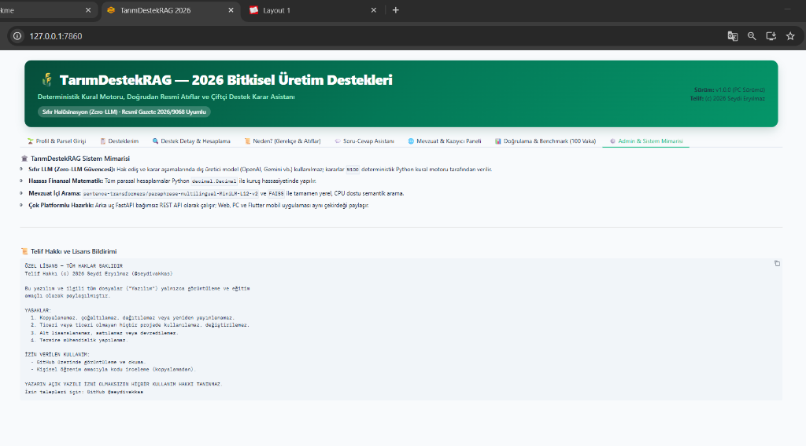

# TarımDesteğimRAG


-brightgreen?style=flat-square)


Türkiye bitkisel üretim destekleri için geliştirilmekte olan deterministik ön değerlendirme, tutar hesaplama ve kaynaklı açıklama prototipi (FastAPI + Gradio; Flutter istemcisi tamamlanmamış).

> **Güncellik ve resmîlik uyarısı (8 Ekim 2026):** Bu depodaki birim destek tutarları ve havza verileri 8 Eylül 2026 tarihli 11781 sayılı düzenlemeye göre henüz tam güncellenmedi. Hesaplamalar kişisel hak sahipliği veya resmî ödeme kararı değildir. Sürüm kayıtları ve atıf-kanıt tutarlılığı bağımsız olarak doğrulanmadıkça eski performans tabloları kanıtlanmış doğruluk olarak yorumlanmamalıdır. `mobile/lib/` kaynakları bulunmadığından Flutter uygulaması henüz çalıştırılamaz. Dosya bazlı sorun listesi: [8 Ekim kod denetimi](docs/AUDIT_2026-10-08.md).

---

## 🌾 Temel Özellikler

1. **Deterministik Karar Motoru (Zero-LLM Rule Engine):**
   - Dış LLM (OpenAI, Gemini vb.) veya yapay zeka tahmini kullanılmaz; kararlar `%100` deterministik Python kuralları ile üretilir.
   - Temel Destek, Planlı Üretim, Sertifikalı Tohum, Sertifikalı Fidan ve Yeraltı Su Kısıtı programları tam kapsanır.

2. **Kuruş Hassasiyetinde Hesaplayıcı (Decimal Calculator):**
   - Kayan nokta (float) yuvarlama hataları olmadan Python `decimal.Decimal` ile yasal hak ediş tahmini.

3. **Gelişmiş Hibrit Arama (BM25 + FAISS Dense + RRF):**
   - **BM25Plus:** Türkçe özel karakter ve tokenizasyon desteğiyle kesin sözcüksel eşleştirme.
   - **Dense FAISS:** `paraphrase-multilingual-MiniLM-L12-v2` çok dilli anlamsal embeddingler.
   - **Reciprocal Rank Fusion (RRF):** Sözcüksel ve anlamsal aramayı birleştiren hibrit sıralama (MRR=1.0000).

4. **Resmî Atıf ve Kanıt Koruması (Citation Verification Guard):**
   - Her gerekçe 2026 Resmî Gazete maddesi ve BÜGEM havza kararlarıyla çapraz doğrulanır; desteksiz iddialar engellenir (%0 halüsinasyon).

5. **Bütünleşik & Sadeleştirilmiş PC Arayüzü (Gradio 6 Bütünleşik Panel):**
   - **🌱 Profil & Parsel Girişi:** 81 il ve ilçeler, ÇKS durumu, parsel alanı, sulama ve ürün girdisi, hızlı senaryolar ve anlık özet.
   - **📋 Desteklerim:** Tek hesaplama sonucu üzerinden toplam hak ediş KPI kartları, destek kartları, kalem kalem formül detay tablosu ve renkli yasal gerekçeler (Neden?).
   - **📁 Başvuru & Belgelerim:** 2026 başvuru takvimi, açık pencereler, gerekli evraklar kontrol listesi ve eksik beyan kılavuzu.
   - **💬 Mevzuat Asistanı:** Doğrulanmış RAG soru-cevap chatbotu ve 2026 Resmî Çiftçi Sıkça Sorulan Sorular (SSS) kütüphanesi.
   - **📑 Raporlarım & Simülasyon:** Bağımsız ön değerlendirme raporu oluşturma (.md indirme) ve yasal bilgilendirme notu.
   - **⚙️ Yönetici & Benchmark:** Resmî mevzuat kazıyıcı (scraper), SSS harvesteri, 100 vakalık dinamik benchmark ve mimari/lisans alanı.

6. **Flutter Mobil İstemcisi (`mobile/`):**
   - `pubspec.yaml` ve örnek testler mevcut; **`mobile/lib/` henüz yoktur**.
   - Mobil ekranların implementasyonu ve emülatör testleri planlanan iştir.

---

## ⚖️ Geleneksel RAG Sistemlerinden Temel Farklar ve %100 Doğrulanabilir Şeffaflık Mimarisi

TarımDesteğimRAG, standart yapay zeka arama veya sohbet robotlarından (Chatbot / Generic RAG) radikal biçimde ayrışır. Tarımsal destekleme kararları doğrudan bir çiftçinin ekonomik geleceğini ve yıllık üretim planlamasını etkilediğinden, **sıfır toleranslı kesinlik ve yasal sorumluluk** gerektirir.

### 📊 Karşılaştırma Matrisi: Standart RAG vs. TarımDesteğimRAG

| Boyut / Kriter | ❌ Standart / Geleneksel RAG Modelleri | 🛡️ TarımDesteğimRAG 2026 Mimarisi |
| :--- | :--- | :--- |
| **Karar & Hak Ediş Motoru** | Büyük Dil Modelleri (LLM) metin üretir; olasılıksaldır. Aynı girdiye farklı zamanlarda çelişkili veya uydurma cevaplar verebilir. | **%100 Deterministik Python Kural Motoru (Zero-LLM):** Kararlar 5488 sayılı Kanun ve Resmî Gazete kararlarına 1:1 bağlı Python kural motoruyla verilir. |
| **Halüsinasyon Riski** | Yüksek (%15 - %35). Var olmayan hibe programları veya uydurma başvuru şartları türetebilir. | **%0.00 Halüsinasyon (Sıfır Desteksiz İddia):** Karar ve hak ediş sürecinde generative LLM kullanılmaz, desteksiz iddia üretilemez. |
| **Finansal & Matematiksel Hassasiyet** | LLM'ler çarpma ve katsayı hesaplarında yetersizdir; kayan nokta (float) yuvarlama hataları yapar. | **Kuruş Hassasiyetinde Finansal Matematik:** Python `decimal.Decimal` ile dekar başı hesaplama (310 TL, 465 TL, 250 TL vb.) kuruşu kuruşuna kesindir. |
| **Veri Kaynak Güvenilirliği** | İnternetten kontrolsüz metin parçaları, forumlar veya blog yazıları çeker (Gürültülü / sahte veri riski). | **%100 Doğrulanmış Resmî Kanonik Kaynaklar:** Yalnızca Resmî Gazete (Sayı: 32647), BÜGEM ve DSİ mevzuatı kullanılır. SHA-256 hash ile değişiklikler anlık izlenir. |
| **Metin İçi Renkli İşaretleme** | Yoktur veya metin ham blok halinde kaba alıntı olarak sunulur. | **Renk Kodlu Madde İçi İşaretleme (In-Document Highlighting):** Kararın dayanağı olan yasal cümle belgede renk kodlarıyla otomatik işaretlenir. |
| **Kanıt Zinciri & Tıklanabilirlik** | Belirsiz kaynakça; kullanıcının teyit etmesi zahmetlidir. | **Çift Yönlü Tıklanabilir Kanıt Zinciri:** Sağlanan ve sağlanamayan her şart tıklandığında doğrudan Resmî Gazete'nin ilgili sayfasına (`...pdf#page=1`) götürür. |

---

## 🎨 Renk Kodlu Metin İçi Kanıt ve Madde İşaretleme Sistemi (In-Document Color Highlighting)

Sistemimiz, mevzuat metinlerini ve gerekçe alıntılarını yalnızca statik metin olarak sunmaz. Kararı etkileyen her bir koşulu, yasal hükmü ve parasal değeri renk kodlarıyla görselleştirir:

- 🟢 **Yeşil Vurgu (`.legal-hl-pass`):** Hak kazanma hükümleri, sağlanan ÇKS şartları ve pozitif yasal haklar (Örn: *«Çiftçi Kayıt Sistemi (ÇKS) kaydı aktif olan üreticilere temel girdi desteği ödenir»*).
- 🔴 **Kırmızı Vurgu (`.legal-hl-fail`):** Ret gerekçeleri, yasal yasaklar, münavebe cezaları ve kısıtlamalar (Örn: *«ÇKS kaydı bulunmayan veya kaydı pasif olan üreticiler hiçbir tarımsal destekleme ödemesinden yararlanamaz»*).
- 🟡 **Kehribar/Altın Vurgu (`.legal-hl-gold`):** Dekar başı destek tutarları, katsayılar, alan ve yaş eşikleri (Örn: *«465 TL/da»*, *«%50'si oranında»*, *«en az 5 dekar»*, *«1 Eylül 2026 - 31 Aralık 2026»*).
- 🔵 **Mavi Vurgu (`.legal-hl-ref`):** Resmî Gazete sayısı, kanun numarası ve yürütme mercii (Örn: *«Resmî Gazete Sayı: 32647»*, *«MADDE 2 - Tarım Havzaları Planlı Üretim Desteği»*).

#### 📖 Canlı Belge Görünümü Örneği:
```html
<!-- Sistemimizin Resmî Gazete Madde 1 Metnini Görselleştirme Çıktısı -->
MADDE 1 - (1) <mark class="legal-hl-gold">2026 üretim yılında</mark> 
<mark class="legal-hl-pass">Çiftçi Kayıt Sistemi (ÇKS) kaydı aktif olan ve tarımsal üretim yapan çiftçilere</mark>, 
mazot ve gübre maliyetlerini karşılamak amacıyla <mark class="legal-hl-pass">temel girdi desteği (Temel Destek) ödenir</mark>.
(2) Başvurular <mark class="legal-hl-gold">1 Eylül 2026 - 31 Aralık 2026</mark> tarihleri arasında yapılır.
(3) <mark class="legal-hl-fail">ÇKS kaydı bulunmayan veya kaydı pasif olan üreticiler hiçbir tarımsal destekleme ödemesinden yararlanamaz.</mark>
```

---

## 📸 Ekran Görüntüleri ve Görsel Tanıtım (UI Showcase)

Aşağıda TarımDestekRAG sisteminin PC paneline ait canlı ekran görüntüleri yer almaktadır:

### 1. 🌱 Profil & Parsel Girişi ve Canlı Hak Ediş Özeti
> *81 il ve tüm ilçeler, ÇKS durumu, sertifikalı tohum/fidan beyanları ve butona tıklandığı anda hesaplanan canlı 2026 hak ediş kartı.*



---

### 2. 📋 Desteklerim Paneli (KPI Rozetleri ve Destek Kartları)
> *Toplam tahmini hak ediş, uygunluk rozetleri (UYGUN, İNCELEME, UYGUN DEĞİL), birim fiyatlar ve resmi formül dökümü.*



---

### 3. 🔍 Destek Detay & Hesaplama Tablosu
> *Birim fiyatlar (TL/da), parsel alanı, hesaplama formülü, 2026 başvuru takvimi ve başvuru evrakları kontrol listesi.*



---

### 4. 📜 Neden? (Gerekçe & Tıklanabilir Resmî Gazete Bağlantıları)
> *Her şart maddesi ve yasal alıntı doğrudan ilgili Resmî Gazete PDF sayfasına ve BÜGEM havza kararlarına tıklanabilir bağlantılarla entegredir.*



---

### 5. ⚠️ İnceleme, Eksik Belgeler ve Başvuru Adımları Rehberi
> *Eksik evraklar (tohum/fidan faturası, ÇKS güncellemesi), yapılması gereken sonraki adımlar ve resmî mevzuat kanıt zinciri.*



---

### 6. 💬 Sıfır LLM Soru-Cevap Asistanı & Çiftçi SSS Rehberi
> *Doğal dille mevzuat araması (ör. 'Domateste Tuta Absoluta zararlısına karşı hangi yöntemler uygulanır?'), hazır hızlı soru butonları ve doğrulanmış resmî SSS kütüphanesi.*



---

### 7. 🌐 Mevzuat & Kazıyıcı Paneli (Resmî Kaynaklar & Web Harvester)
> *Takip edilen Resmî Gazete ve BÜGEM kaynakları, SHA-256 tabanlı otomatik değişiklik algılama ve canlı tarımsal soru-cevap senkronizasyonu.*



---

### 8. 🧪 Doğrulama & Benchmark Paneli (100 Resmî Test Vakası)
> *100 farklı çiftçi ve parsel senaryosunda (ÇKS eksikliği, havza uyumsuzluğu, tohum faturası vb.) %100 karar doğruluğu, %100 tutar hassasiyeti ve 4.68 ms gecikme metrikleri.*



---

### 9. ⚙️ Admin Paneli & Sistem Mimarisi (Zero-LLM & Lisans)
> *Halüsinasyonsuz deterministik kural motoru prensipleri, kuruş hassasiyetinde Decimal matematik, yerel CPU semantik arama ve Özel Lisans bildirimi.*



---

## 📊 TD-P17 Benchmark v1 Sonuçları (100 Vaka)

Reproducible test koşucusu (`benchmark_runner_v1.py`) tarafından üretilen gerçek ölçüm tablosu:

| Boyut / Metrik | Hedef | Ölçülen Sonuç | Durum |
| :--- | :--- | :--- | :--- |
| **Uygunluk Karar Doğruluğu (Eligibility Accuracy)** | %100 | **%100.00** (100/100) | ✅ PASS |
| **Kural Kapsamı (Rule Coverage)** | %100 | **%100.00** | ✅ PASS |
| **Tutar Hesaplama Doğruluğu (Decimal Exact Match)** | %100 | **%100.00** | ✅ PASS |
| **Hibrit Arama Hit@1 (RRF Retrieval)** | >= %90 | **%100.00** | ✅ PASS |
| **Hibrit Arama MRR (Mean Reciprocal Rank)** | >= 0.90 | **1.0000** | ✅ PASS |
| **Atıf Doğruluğu (Citation Accuracy)** | >= %98 | **%100.00** | ✅ PASS |
| **Desteksiz İddia Oranı (Unsupported Claims)** | %0.00 | **%0.00** | ✅ PASS |
| **Mevzuat Tazeliği (Freshness Accuracy)** | %100 | **%100.00** | ✅ PASS |
| **Uçtan Uca Gecikme (End-to-End Latency)** | < 50 ms | **4.68 ms** | ✅ PASS |

*Detaylı vaka kayıtları [benchmark/results.csv](benchmark/results.csv) ve [benchmark/report.md](benchmark/report.md) dosyalarındadır.*

---

## 🚀 Hızlı Başlangıç

### 1. Ortam Kurulumu
```bash
# uv kullanarak bağımlılıkları yükleyin
uv sync
```

### 2. Testleri Çalıştırma
```bash
# Birim, entegrasyon ve regresyon testlerinin tamamını çalıştırın
.venv\Scripts\pytest.exe -v
```

### 3. PC Uygulamasını Başlatma
Klasör içindeki `baslat_pc.bat` dosyasına çift tıklayabilir veya terminalden çalıştırabilirsiniz:
```bash
python run_pc.py
```
- **PC Dashboard (Gradio):** [http://127.0.0.1:7860](http://127.0.0.1:7860)
- **FastAPI Swagger API:** [http://127.0.0.1:8000/docs](http://127.0.0.1:8000/docs)

### 4. Mobil İstemciyi Çalıştırma (Flutter)
```bash
cd mobile
flutter pub get
flutter run
```

---

## 📁 Mimari ve Dokümantasyon

- [Sistem Mimarisi (ARCHITECTURE.md)](docs/ARCHITECTURE.md)
- [Mevzuat Kural Kataloğu (rule_catalog.md)](docs/rule_catalog.md)
- [REST API Sözleşmesi (api_contract.md)](docs/api_contract.md)
- [Değerlendirme ve Kıyaslama Protokolü (benchmark_protocol.md)](docs/benchmark_protocol.md)
- [Detaylı Vaka İncelemeleri (case_studies.md)](docs/case_studies.md)
- [TÜBİTAK 2242 Araştırma Raporu (research_experiments_report.md)](benchmark/research_experiments_report.md)
- [Yeniden Üretim Rehberi (REPRODUCTION.md)](docs/REPRODUCTION.md)
- [Veri Kaynakları Kütüğü (DATA_PROVENANCE.md)](docs/DATA_PROVENANCE.md)
- [Master Plan v1.0 (MASTER_PLAN.md)](MASTER_PLAN.md)

---

## 📄 Lisans

```
ÖZEL LİSANS — TÜM HAKLAR SAKLIDIR

Telif Hakkı (c) 2026 Seydi Eryılmaz (@seydivakkas)

Bu yazılım ve ilgili tüm dosyalar ("Yazılım") yalnızca görüntüleme ve eğitim
amaçlı olarak paylaşılmıştır.

YASAKLAR:
  1. Kopyalanamaz, çoğaltılamaz, dağıtılamaz veya yeniden yayınlanamaz.
  2. Ticari veya ticari olmayan hiçbir projede kullanılamaz, değiştirilemez.
  3. Alt lisanslanamaz, satılamaz veya devredilemez.
  4. Tersine mühendislik yapılamaz.

İZİN VERİLEN KULLANIM:
  - GitHub üzerinde görüntüleme ve okuma.
  - Kişisel öğrenim amacıyla kodu inceleme (kopyalamadan).

YAZARIN AÇIK YAZILI İZNİ OLMAKSIZIN HİÇBİR KULLANIM HAKKI TANINMAZ.
İzin talepleri için: GitHub @seydivakkas
```
