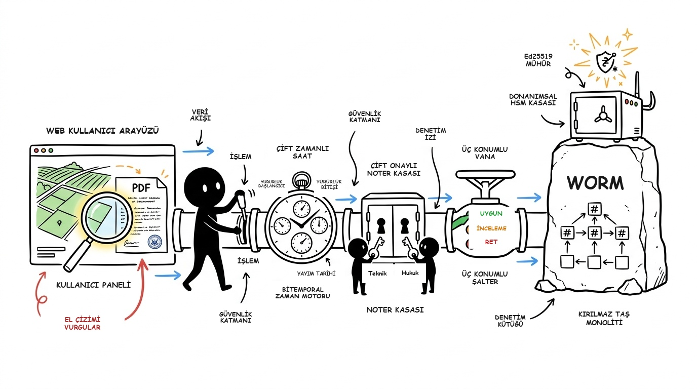
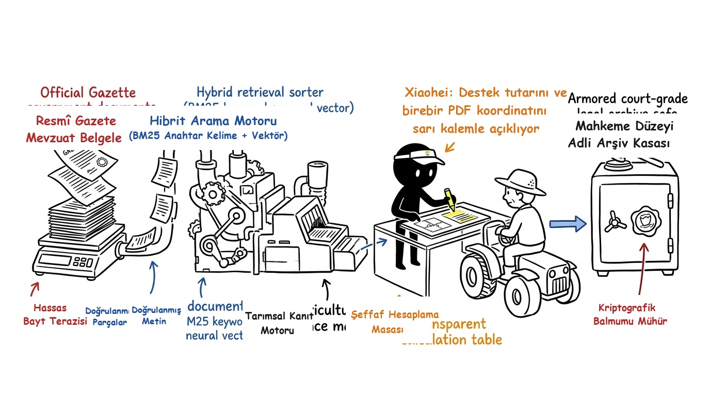

# TarımDestekRAG — Sistem Mimarisi

> **Telif Hakkı (c) 2026 Seydi Eryılmaz (@seydivakkas)**  
> **ÖZEL LİSANS — TÜM HAKLAR SAKLIDIR**

---

## 1. Mimari Genel Bakış

TarımDestekRAG, Türkiye'deki 2026 bitkisel üretim desteklerine ilişkin mevzuat hükümlerini ve çiftçi verilerini deterministik olarak işleyen, hibrit RAG destekli bir karar destek sistemidir.

Tüm sistem bileşenleri, [helloianneo/ian-xiaohei-illustrations](https://github.com/helloianneo/ian-xiaohei-illustrations) felsefesine uygun olarak 16:9 minimalist infografik mimariyle modellenmiştir:



> 📖 **Detaylı Mimari İnceleme ve Kaynak Kod Karşılıkları:** Her bir katmanın güvenlik kuralları ve kaynak dosya eşleştirmeleri için [P0_14_IAN_XIAOHEI_FULLSTACK_ARCHITECTURE.md](P0_14_IAN_XIAOHEI_FULLSTACK_ARCHITECTURE.md) raporuna başvurunuz.

```text
Resmî Kaynaklar (Resmî Gazete, BÜGEM)
           │
           ▼
[Web Scraper & Change Detector (SHA-256)]
           │
           ▼
[ETL & Normalizasyon Motoru]
           │
           ▼
┌───────────────────────────────┬───────────────────────────────┐
│  Deterministik Yapılandırılmış │  Semantik & Sözcüksel İndeks  │
│          Veritabanı           │          (FAISS + BM25)       │
│           (SQLite)            │                               │
└──────────────┬────────────────┴───────────────┬───────────────┘
               │                                │
               ▼                                ▼
       [Rule Engine (Sıfır LLM)]        [Hibrit Arama (RRF)]
               │                                │
               ▼                                │
       [Support Calculator (Decimal)]           │
               │                                │
               └───────────────┬────────────────┘
                               │
                               ▼
                   [Template RAG Explainer]
                               │
                               ▼
                 [Citation Verifier Guard]
                               │
               ┌───────────────┴───────────────┐
               ▼                               ▼
       [FastAPI Backend]               [PC Web Arayüzü (Gradio)]
               │
               ▼
     [Flutter Mobil Uygulaması]
```

---

## 2. Hukuki Delil ve Veri Akış Hattı

Resmî Gazete'den çiftçinin ekranına ve mahkeme adli delil kasasına uzanan veri ve ispat zinciri:



1. **SHA-256 Bayt Terazisi:** 1.436.150 baytlık Resmî Gazete PDF'i bayt bayt tartılır, hash uyuşmazlığında sistem FAIL-CLOSED durumuna geçer.
2. **Hibrit Arama:** BM25 ve çok dilli FAISS indeksleri üzerinden RRF birleşimiyle mevzuat hükümleri taranır.
3. **Şeffaf İspat Masası:** Çiftçinin hak ediş tutarı (`50 da x 244 TL = 12.200 TL`) kuruş hassasiyetiyle hesaplanır ve Resmî Gazete PDF'inde sarı vurgu ile koordinat bazlı işaretlenir.
4. **Adli Delil Kasası:** Merkle kökü özetleri periyodik checkpoint'lerle taşa kazınır (WORM) ve mahkemeye sunulabilir mühürlü arşiv üretilir.

---

## 3. Değiştirilemez İlke: Zero-LLM Karar Motoru

Sistemde uygunluk kararları ve tutar hesaplamaları için **asla yapay zeka/LLM tahmini kullanılmaz**:

```text
LLM != Eligibility Decision
```

1. **Karar Determinizmi:** Uygunluk kuralları (`BasicSupportRule`, `PlannedProductionRule`, `CertifiedSeedRule`, `CertifiedSaplingRule`, `WaterRestrictionRule`) saf Python mantığıyla çalışır.
2. **Kuruş Hassasiyeti:** Tüm parasal büyüklükler Python `decimal.Decimal` ile hesaplanır. Kayan noktalı (`float`) yuvarlama hatası imkansızdır.
3. **Atıf ve Kanıt Koruması:** `CitationVerifier`, her açıklamanın geçerli ve mülga olmayan 2026 Resmî Gazete maddesine dayandığını denetler; desteksiz iddiaları (%0 halüsinasyon) engeller.

---

## 4. Hibrit Arama ve Bilgi Getirme (Hybrid Retrieval)

Bilgi getirme motoru, sözcüksel ve yoğun anlamsal aramayı **Reciprocal Rank Fusion (RRF)** ile birleştirir:

- **BM25Plus:** Türkçe özel karakter ve tokenizasyon desteğiyle tam sözcük eşleştirmesi.
- **Dense Vector:** `paraphrase-multilingual-MiniLM-L12-v2` embedding modeli ve `faiss-cpu` indeksi.
- **RRF Formülü:**

$$RRF\_Score(d) = \frac{w_{\text{dense}}}{60 + \text{rank}_{\text{dense}}(d)} + \frac{w_{\text{bm25}}}{60 + \text{rank}_{\text{bm25}}(d)}$$

---

## 5. Kullanıcı Arayüzleri

1. **PC Web Arayüzü (Gradio):** 9 sekmeli masaüstü yönetim paneli:
   - Tekil Parsel Değerlendirme
   - Destek Karşılaştırma
   - Mevzuat Soru-Cevap
   - Çoklu Parsel Simülasyonu
   - Benchmark v1 Koşucusu
   - Canlı Veritabanı İzleyici
   - Resmî Kaynak Kütüğü
   - Sistem Durumu & Metrikler
   - Master Plan & Lisans
2. **Flutter Mobil İstemcisi (`mobile/`):** Temiz mimari (Clean Architecture) ile geliştirilmiş, Android ve iOS uyumlu, erişilebilir mobil arayüz.
