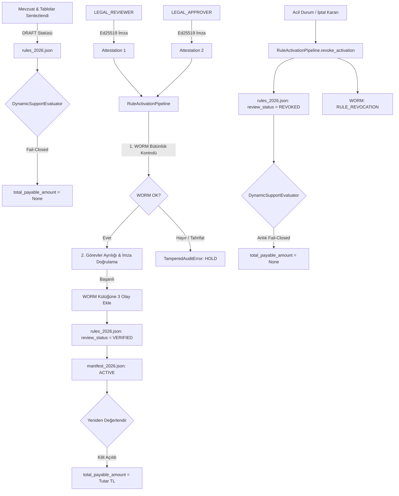

# ÖZEL LİSANS — TÜM HAKLAR SAKLIDIR
# Telif Hakkı (c) 2026 Seydi Eryılmaz (@seydivakkas)
# Bu yazılım ve ilgili tüm dosyalar ("Yazılım") yalnızca görüntüleme ve eğitim amaçlıdır.
#
# YASAKLAR:
#   1. Kopyalanamaz, çoğaltılamaz, dağıtılamaz veya yeniden yayınlanamaz.
#   2. Ticari veya ticari olmayan hiçbir projede kullanılamaz, değiştirilemez.
#   3. Alt lisanslanamaz, satılamaz veya devredilemez.
#   4. Tersine mühendislik yapılamaz.
#
# İZİN VERİLEN KULLANIM:
#   - GitHub üzerinde görüntüleme ve okuma.
#   - Kişisel öğrenim amacıyla kodu inceleme (kopyalamadan).
#
# YAZARIN AÇIK YAZILI İZNİ OLMAKSIZIN HİÇBİR KULLANIM HAKKI TANINMAZ.
# İzin talepleri için: GitHub @seydivakkas

# P0-12: Çift Onaylı Hukuki İnceleme & WORM Aktivasyon Hattı

## 1. Mimarî Genel Bakış

TarımDestekRAG sisteminde çiftçilere yönelik hak ediş ve mali destek ödemelerinin hesaplanması, **sıfır halüsinasyon** ve **kesin hukuki denetim** gerektirir. P0-10 (Resmî Mevzuat Keşfi) ve P0-11 (Dinamik Kural & Fiyat Motoru) ile sentezlenen tüm kurallar başlangıçta `DRAFT` (taslak) statüsünde sisteme kaydedilir.

**Fail-Closed Güvenlik İlkesi:**
Taslak durumundaki hiçbir kural resmî onay almaksızın ödemeye (`total_payable_amount`) dönüştürülemez. `DynamicSupportEvaluator` simülatif olarak önerilen tutarı (`total_proposed_amount`) gösterse dahi, `total_payable_amount` değerini `None` olarak kilitler.

P0-12 geliştirme paketiyle, kuralların `VERIFIED` statüsüne yükseltilmesi ve bütçe yürürlüğünün başlatılması için:
1. **İki Bağımsız Yetkili İmzası (Separation of Duties - Ed25519)**
2. **Kriptografik Olarak Zincirlenmiş WORM (Write-Once-Read-Many) Denetim İzi**
3. **Atomik Aktivasyon ve Anlık Fail-Closed İptal (Revocation) Mekanizması**

devreye alınmıştır.

---

## 2. Ayrık Yetki İlkesi (Separation of Duties) & Ed25519 Kriptografisi

Sistemde tek bir yetkilinin veya yöneticinin tek başına kural yürürlüğe alması kesin olarak engellenmiştir.

| Yetkili Rolü | Unvan / Görev | Sorumluluk Kapsamı |
|---|---|---|
| `LEGAL_REVIEWER` | Hukuk Müşaviri / Mevzuat İnceleyicisi | Resmî Gazete karar metni, madde atıfları ve ek tabloların hukuki tutarlılığını tasdik eder. |
| `LEGAL_APPROVER` | Hukuk Başkanı / Harcama Yetkilisi | Bütçe tahsisi, ödeme yetkilendirmesi ve yürürlüğe alma kararını onaylar. |

### Kriptografik Kurallar:
- **Asimetrik Anahtarlar:** Her yetkili 32-baytlık bağımsız Ed25519 anahtar çiftine (`Ed25519PrivateKey` / `Ed25519PublicKey`) sahiptir.
- **Aktör Ayrılığı:** `reviewer.actor_id != approver.actor_id` (aynı aktör iki rolü birden üstlenemez; `SeparationOfDutiesViolation`).
- **Anahtar Ayrılığı:** `reviewer.public_key_b64 != approver.public_key_b64` (aynı genel anahtar iki rolde kullanılamaz).
- **Kanonik İmzalama Yükü (Canonical Payload):** Her iki yetkili de kanonik (alfabetik anahtar sıralı, boşluksuz JSON) manifest yükünü imzalar:
  ```json
  {
    "attestation_statement": "2026 yılı tarımsal destekleme kuralları... incelenmiş ve doğrulanmıştır.",
    "production_year": 2026,
    "rule_count": 24,
    "rules_digest": "4f8a... (SHA-256)",
    "source_document_sha256": "e3b0... (SHA-256)"
  }
  ```

---

## 3. Kriptografik WORM (Write-Once-Read-Many) Denetim Kütüğü

WORM kütüğü (`WormAuditLog`), mevzuat onay süreçlerinin değiştirilemez, silinemez ve sıra numarası bozulamaz bir blok zincir yapısında tutulmasını sağlar (`data/legal_update_archive/worm_audit/audit_chain.jsonl`).

### Blok Yapısı (`WormBlock`)
Her denetim bloğu aşağıdaki kanonik alanları içerir:
- `block_index`: Blok sıra numarası (Genesis = 0, 1, 2, ...).
- `event_id`: Benzersiz UUID4 kimliği.
- `timestamp_utc`: ISO 8601 UTC zaman damgası.
- `production_year`: İlgili tarımsal üretim yılı.
- `event_type`: Olay tipi (`GENESIS`, `ATTESTATION_REVIEW`, `ATTESTATION_APPROVAL`, `RULE_ACTIVATION`, `RULE_REVOCATION`).
- `actor_id`: İşlemi gerçekleştiren yetkilinin kimliği.
- `role`: Yetkilinin rolü (`SYSTEM`, `LEGAL_REVIEWER`, `LEGAL_APPROVER`, `ADMIN`).
- `manifest_sha256`: İmzalanan kural özetinin SHA-256 hash'i.
- `signature_b64`: Ed25519 dijital imzası.
- `public_key_b64`: İmzayı atan Ed25519 genel anahtarı.
- `previous_block_sha256`: Bir önceki bloğun `block_sha256` değeri (Genesis için `0`*64).
- `block_sha256`: Mevcut bloğun kanonik alanları üzerinden hesaplanan SHA-256 özeti.

### Tahrifat Algılama (Tamper Detection)
`verify_chain()` metodu kütükteki tüm blokları baştan sona denetler:
- Bir satırdaki metin veya hash değiştirilmişse,
- Bloklar silinmiş veya araya sahte blok eklenmişse,
- Önceki blok hash bağlantısı kopmuşsa,

sistem derhal `TamperedAuditError` fırlatır ve tüm aktivasyon hatlarını kilitler.

---

## 4. Atomik Aktivasyon ve Revocation Yaşam Döngüsü



---

## 5. REST API Uç Noktaları

| Metot | Uç Nokta | Açıklama | Yetki |
|---|---|---|---|
| `POST` | `/admin/rules/attestation` | Yetkili Ed25519 özel anahtarı ile kanonik beyanı imzalar ve tasdik nesnesi döner. | Yönetici (`X-Admin-Key`) |
| `POST` | `/admin/rules/activate` | Çift tasdiki doğrular, WORM kütüğüne işler ve kuralları `VERIFIED` yapar. | Yönetici (`X-Admin-Key`) |
| `GET` | `/admin/rules/activation-status` | Üretim yılının aktivasyon, manifesto ve WORM zincir bütünlük durumunu döner. | Yönetici (`X-Admin-Key`) |
| `POST` | `/admin/rules/revoke` | Yürürlüğü anında iptal eder (`VERIFIED` -> `REVOKED`) ve WORM günlüğüne yazar. | Yönetici (`X-Admin-Key`) |
| `GET` | `/admin/rules/worm-audit` | WORM denetim kütüğü bloklarını ve zincir doğrulama sonucunu döner. | Yönetici (`X-Admin-Key`) |

---

## 6. PC Yönetim Paneli (Gradio) Entegrasyonu

`frontend_pc/pages/admin_validation.py` sekmesinde `P0-12` kontrol paneli yer alır:
- **Durum & WORM Zincirini Denetle:** Tek tıkla o yıla ait manifestoyu, kural durum dağılımını ve WORM blok tablosunu görüntüler.
- **Çift Onaylı Aktivasyonu Gerçekleştir:** İki bağımsız anahtar çiftiyle hukuki tasdik ve harcama onayını simüle ederek kuralları yürürlüğe alır.
- **Yürürlüğü İptal Et (REVOKE):** Gerekçe girilerek acil durdurma emri verilir, kurallar anında `REVOKED` durumuna çekilir.

---

## 7. Test Doğrulama Sonuçları

`backend/tests/unit/test_p0_12_dual_approval_and_worm.py` dosyasındaki testler:
- `test_ed25519_keypair_and_sign_verify`: Başarılı.
- `test_worm_genesis_and_chain_append`: Başarılı.
- `test_worm_tamper_detection`: Başarılı.
- `test_separation_of_duties_same_actor_rejected`: Başarılı.
- `test_separation_of_duties_same_key_rejected`: Başarılı.
- `test_invalid_signature_rejected`: Başarılı.
- `test_trusted_key_validation`: Başarılı.
- `test_full_activation_and_evaluator_lifecycle`: Başarılı.
- `test_api_admin_rules_endpoints`: Başarılı.

**Toplam Repo Testleri:** 368 birim testin tamamı `%100` başarıyla geçmiştir.
