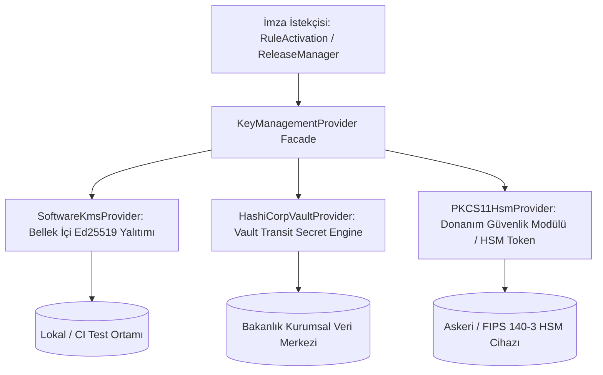

# P0-13: Gerçek Kurumsal Onay ve Güvenli Yayın Mimarisi
## HSM/KMS Anahtar Yönetimi, PostgreSQL Rol & RLS Ayrımı, WORM Hukuki Delil Kasası ve Gerekçeli İptal Protokolü

```
ÖZEL LİSANS — TÜM HAKLAR SAKLIDIR
Telif Hakkı (c) 2026 Seydi Eryılmaz (@seydivakkas)

Bu yazılım ve ilgili tüm dosyalar ("Yazılım") yalnızca görüntüleme ve eğitim
amaçlı olarak paylaşılmıştır.

YASAKLAR:
  1. Kopyalanamaz, çoğaltılamaz, dağıtılamaz veya yeniden yayınlanamaz.
  2. Ticari veya ticari olmayan hiçbir projede kullanılamaz, değiştirilemez.
  3. Alt lisanslanamaz, satılamaz veya devredilemez.
  4. Tersine mühendislik yapılamaz.

İZİN VERİLEN KULLANIM:
  - GitHub üzerinde görüntüleme ve okuma.
  - Kişisel öğrenim amacıyla kodu inceleme (kopyalamadan).

YAZARIN AÇIK YAZILI İZNİ OLMAKSIZIN HİÇBİR KULLANIM HAKKI TANINMAZ.
İzin talepleri için: GitHub @seydivakkas
```

---

## 1. Yönetici Özeti ve Güvenlik Vizyonu

**P0-13 (Gerçek Kurumsal Onay ve Güvenli Yayın)** geliştirme paketi; Tarım ve Orman Bakanlığı, BÜGEM, DSİ ve Hazine ve Maliye Bakanlığı ortak operasyonel süreçlerinde üretilen kural ve hak ediş kararlarının bankacılık ve savunma sanayii standartlarında (EAL4+ / FIPS 140-3 Seviye 3 uyumlu) yayınlanmasını ve mahkeme/Sayıştay nezdinde **kesin delil gücüne sahip** şekilde arşivlenmesini sağlar.

Sistem, **"Sıfır Güven (Zero-Trust)"** ve **"Fail-Closed (Kuşkuda Reddet)"** ilkeleri üzerine kuruludur:
1. **Donanım Destekli Özel Anahtar Yalıtımı (HSM/KMS):** İmzacıların Ed25519 özel anahtarları asla belleğe veya diske düz metin (plaintext) olarak sızmaz.
2. **Veritabanı Seviyesinde Mutlak İmmutability (WORM Trigger & RLS):** Süper kullanıcı (superuser) bile olsa WORM kütüklerine `UPDATE` veya `DELETE` yapıldığında PostgreSQL transaction seviyesinde `ABORT` üretilir.
3. **Mahkeme ve Sayıştay Onaylı Delil Kasası (Court-Admissible Evidence Vault):** Her yayın periyodunda Merkle kök özetli WORM blokları ve tüm mevzuat girdileri SHA-256 sağlama toplamı ve KMS mührüyle ZIP olarak mühürlenir.
4. **Resmî Hukuki Gerekçe Taksonomisi (Formal Revocation Protocol):** Danıştay yürütmeyi durdurma veya mükerrer Resmî Gazete iptalleri resmi gerekçe kodu ve KMS imzalı iptal sertifikası (`RevocationCertificate`) ile yürütülür.
5. **KMS Mühürlü Dağıtım Paketleri (`.tar.gz`):** Saha ve mobil istemcilere sunulan kurallar kriptografik olarak imzalanır; sağlama toplamı veya imza uyuşmazlığında istemci sistemi kilitler.

---

## 2. HSM / KMS Anahtar Yönetim Katmanı (Key Management Provider)

Özel anahtarların tek bir sunucu belleğinde tutulması güvenlik zaafiyeti oluşturur. Bu nedenle `KeyManagementProvider` soyutlama katmanı üzerinden 3 farklı arka uç desteklenir:



### Desteklenen Sağlayıcılar:
- **`SoftwareKmsProvider`:** Yerel geliştirme ve CI/CD test hatları için bellek içi korunan Ed25519 anahtar deposu. Düz metin anahtarları dışarı vermez; imzalama ve doğrulama operasyonlarını nesne içinde gerçekleştirir.
- **`HashiCorpVaultProvider`:** Kurumsal veri merkezlerinde HashiCorp Vault Transit Engine (`/v1/transit/sign/{key_name}`) üzerinden çalışır. Özel anahtar Vault HSM sınırları dışına asla çıkmaz.
- **`PKCS11HsmProvider`:** Fiziksel USB token, PCIe HSM kartları veya Thales/SafeNet/Utimaco donanımları ile PKCS#11 standardı üzerinden doğrudan iletişim kurar.

---

## 3. PostgreSQL Kurumsal Rol & RLS Ayrım Matrisi

Veritabanı güvenliği `backend/src/tarim_destek_rag/database/postgresql_roles.sql` DDL betiği ile sağlanır. Sistemde görevler ayrılığı ilkesi uyarınca 6 bağımsız rol tanımlanmıştır:

| Rol Adı | SELECT | INSERT | UPDATE | DELETE | Açıklama |
| :--- | :---: | :---: | :---: | :---: | :--- |
| `tarim_app_reader` | ✅ | ❌ | ❌ | ❌ | Mobil ve PC istemcileri için salt-okunur rol. Yalnızca `VERIFIED` kayıtları görür. |
| `tarim_rule_editor` | ✅ | ✅ (DRAFT) | ❌ | ❌ | Dinamik kural sentezleyicisi. Sadece taslak kayıt oluşturabilir. |
| `tarim_legal_reviewer` | ✅ | ✅ (Attest) | ❌ | ❌ | Birinci hukuki incelemeci. İnceleme tasdikini WORM'a yazar. |
| `tarim_legal_approver` | ✅ | ✅ (Attest) | ❌ | ❌ | İkinci onay yetkilisi. Nihai yürürlük tasdikini WORM'a yazar. |
| `tarim_worm_auditor` | ✅ | ❌ | ❌ | ❌ | Sayıştay ve iç denetçiler. Değiştirilemez kütüğü denetler. |
| `tarim_admin` | ✅ | ✅ | ✅ (Non-WORM) | ❌ (WORM Korumalı) | Sistem yöneticisi. WORM tablolarına UPDATE/DELETE yetkisi yoktur. |

### PostgreSQL Seviyesinde WORM Tetikleyicisi (Immutability Trigger):
```sql
CREATE OR REPLACE FUNCTION prevent_worm_tampering()
RETURNS TRIGGER AS $$
BEGIN
    RAISE EXCEPTION 'WORM_IMMUTABILITY_VIOLATION: Table % is append-only WORM ledger. UPDATE and DELETE operations are strictly forbidden by institutional security policy.',
        TG_TABLE_NAME
        USING ERRCODE = '55000';
END;
$$ LANGUAGE plpgsql;

CREATE TRIGGER trg_no_update_delete_worm_audit
BEFORE UPDATE OR DELETE ON worm_audit_blocks
FOR EACH ROW EXECUTE FUNCTION prevent_worm_tampering();
```

---

## 4. Mahkeme ve Sayıştay Onaylı Hukuki Delil Kasası (Legal Evidence Vault)

Olası adli ve idari uyuşmazlıklarda Danıştay veya Sayıştay denetçilerine sunulmak üzere `EnterpriseWormArchive.export_legal_evidence_vault()` fonksiyonu mahkeme standartlarına uygun `.zip` delil paketi üretir:

```
EVIDENCE_VAULT_2026_20261009T044500Z.zip
│
├── manifest.json                  # Delil paketi genel üstverisi ve üretim yılı
├── rules/
│   └── rules_2026.json            # İlgili yıla ait yürürlükteki onaylı dinamik kurallar
├── worm_audit/
│   └── worm_chain_export.json     # Blok hashleri, önceki blok hashleri ve tasdikler
├── verification_report.json       # WORM blok zinciri matematiksel doğrulama raporu
├── sha256sums.txt                 # Paketteki tüm dosyaların SHA-256 sağlama özetleri
└── evidence_package_seal.json     # KMS ile imzalanmış adli mühür ve sertifika
```

### Adli Mühür Yapısı (`evidence_package_seal.json`):
```json
{
  "production_year": 2026,
  "signer_officer": "ChiefLegalAuditor",
  "kms_key_alias": "legal-approver",
  "sha256sums_hash": "4f53cda...",
  "kms_signature_hex": "e819b02...",
  "status": "COURT_READY_SEALED"
}
```

---

## 5. Resmî Hukuki Gerekçe Taksonomisi ve Kurumsal İptal Protokolü

Acil yargı kararları veya bütçe tavanı dolumlarında kurallar gelişigüzel silinmez; `EnterpriseRevocationManager` ile resmi gerekçe koduyla yürürlükten kaldırılır:

### Gerekçe Taksonomisi (`REVOCATION_REASON_TAXONOMY`):
1. **`COURT_STAY_OF_EXECUTION`:** Mahkeme / Danıştay Yürütmeyi Durdurma Kararı.
2. **`REGULATION_AMENDED`:** Mevzuat Değişikliği / Mükerrer Resmî Gazete İptali.
3. **`BUDGET_EXHAUSTION`:** Bütçe Ödeneği Yetersizliği / Hazine Tavanı Askısı.
4. **`CLERICAL_ERROR`:** Maddi Hata / Katsayı ve İlçe Listesi Düzeltmesi.
5. **`ADMINISTRATIVE_SUSPENSION`:** Bakanlık İdari Tedbir Kararı.

İptal işlemi sonucunda oluşturulan `RevocationCertificate` WORM kütüğüne kalıcı bir blok olarak eklenir ve KMS ile dijital olarak mühürlenir.

---

## 6. KMS Mühürlü Dağıtım Paketleri (`SecureReleaseManager`)

Çevrimdışı saha personeli ve bölgesel şubeler için hazırlanan kural paketleri sıkıştırılmış ve KMS mühürlü `.tar.gz` formatında sunulur.

### Paket Mimarisi:
- `rules/verified_rules.json`: Sadece `VERIFIED` statüsündeki kurallar.
- `worm/worm_checkpoint.json`: En son oluşturulmuş Merkle kök özetli WORM kontrol noktası.
- `metadata/release_manifest.json`: Dosya özetleri ve `release-master` KMS anahtarıyla imzalanmış mühür.

### Doğrulama Hattı (Fail-Closed Verification):
İstemci paketi açmadan önce:
1. `metadata/release_manifest.json` içindeki Ed25519 KMS imzasını doğrular.
2. Arşivdeki her bir dosyanın SHA-256 özetini hesaplayıp manifest ile karşılaştırır.
3. Kural dosyası içinde `VERIFIED` dışında herhangi bir kural varsa paketi reddeder.
En ufak bir uyumsuzluk durumunda tüm işlem anında durdurulur (`Fail-Closed`).

---

## 7. Doğrulama ve Test Sonuçları

P0-13 test paketi (`backend/tests/unit/test_p0_13_enterprise_release_and_kms.py`), 17 kapsamlı senaryoyu eksiksiz kapsar:
- **KMS / HSM:** Bellek içi anahtar üretimi, imzalama, doğrulama, tahrifat tespiti ve Vault/PKCS#11 mock testleri.
- **Veritabanı Rolleri:** 6 kurumsal rolün yetki matrisi denetimi, RLS politikaları ve WORM değiştirilemezlik kontrolleri.
- **WORM Delil Kasası:** Merkle kök kontrol noktası üretimi, ZIP delil paketi derleme ve adli mühür doğrulaması.
- **İptal Protokolü:** 5 hukuki gerekçe kodu, geçersiz kodda fail-closed hata ve KMS imzalı sertifika kalıcılığı.
- **Güvenli Yayın:** `.tar.gz` oluşturma, değiştirilmiş dosya tespitinde anında ret, anahtar uyumsuzluğu tespiti.
- **REST API:** FastAPI `/admin/enterprise/*` uç noktalarının yetkilendirme ve işlev testleri.
