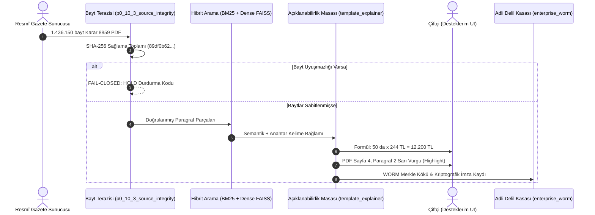

<!--
ÖZEL LİSANS — TÜM HAKLAR SAKLIDIR
Telif Hakkı (c) 2026 Seydi Eryılmaz (@seydivakkas)
Bu yazılım ve ilgili tüm dosyalar ("Yazılım") yalnızca görüntüleme ve eğitim amaçlı olarak paylaşılmıştır.
YASAKLAR: Kopyalanamaz, çoğaltılamaz, dağıtılamaz, satılamaz, tersine mühendislik yapılamaz.
İZİN VERİLEN KULLANIM: GitHub üzerinde görüntüleme ve inceleme.
-->

# 🎨 TarımDesteğimRAG — Ian Xiaohei Felsefesiyle Full-Stack Sistem Mimarisi

> **"Bir sistemi anlamak, onun içindeki bilişsel eylemleri, karar kilitlerini ve veri akışını görmektir."**  
> Bu belge, [helloianneo/ian-xiaohei-illustrations](https://github.com/helloianneo/ian-xiaohei-illustrations) felsefesiyle oluşturulan 16:9 minimalist el çizimi illüstrasyonları, Mermaid sistem şemalarını ve projenin kod tabanındaki gerçek mühendislik karşılıklarını bir araya getirir.

---

## 🏛️ 1. Büyük Resim: Full-Stack Uçtan Uca Sistem Mimarisi

Aşağıdaki görselde Xiaohei (Sistem Nöbetçimiz); kullanıcı arayüzünden başlayıp, bitemporal zaman saatinden, çift onaylı noter kasasından ve üç konumlu vanadan geçerek taşa kazınan WORM kütüğüne ve HSM donanım kasasına kadar tüm full-stack mekanizmasını bizzat yönetmektedir.

### 🧩 Katmanlar ve Mühendislik Karşılıkları

```mermaid
graph LR
    subgraph Frontend ["1. İstemci & Görsel Katman"]
        UI_PC["Gradio PC Dashboard<br/>(frontend_pc/app.py)"]
        UI_FARM["Çiftçi Parsel & Analiz<br/>(support_analysis.py)"]
        UI_ADM["Yönetim & Doğrulama<br/>(admin_validation.py)"]
    end

    subgraph Gateway ["2. API & Güvenlik Ağ Geçidi"]
        API["FastAPI Motoru<br/>(tarim_destek_rag/api/main.py)"]
        AUTH["Bearer Token & Rol Denetimi<br/>(security/database_roles.py)"]
    end

    subgraph Engines ["3. Karar & Değerlendirme Çekirdeği"]
        TIME["Bitemporal Zaman Motoru<br/>(Yayım / Yürürlük / Geriye Yürüme)"]
        NOTARY["Çift Onaylı Hukuk Hattı<br/>(Teknik + Hukuk Ed25519)"]
        TRISTATE["Üç Konumlu Mantık Şalteri<br/>(Eligible / Ineligible / Review)"]
    end

    subgraph Trust ["4. Kriptografi & WORM Arşiv"]
        WORM["Değiştirilemez WORM Kütüğü<br/>(Merkle Root Checkpoints)"]
        HSM["Donanımsal HSM / KMS<br/>(Software / Vault / PKCS11)"]
        VAULT["Adli Delil Kasası<br/>(Mahkeme Mühürlü ZIP)"]
    end

    Frontend -->|HTTP / REST| Gateway
    Gateway -->|Yetkilendirilmiş İstek| Engines
    Engines -->|Atomik Mühürleme| Trust
```

---

## ⚖️ 2. Veri ve Hukuki Kanıt Hattı: Resmî Gazete'den Çiftçiye ve Mahkemeye

Aşağıdaki görselde Xiaohei; Resmî Gazete baytlarını hassas terazide tartmakta, hibrit arama motorundan geçirip cam masada çiftçiye PDF sayfasını büyüteçle aydınlatmakta ve tüm süreci adli makamlara sunulmak üzere mühürlü delil kasasına kilitlemektedir.

### 🌊 Veri Akış Hattı Aşamaları

---

## 🔍 3. Proje Bileşenlerinin Detaylı Dosya Haritası

| Çizimdeki Öğe | Mimari Rolü | Projedeki Dosya Yolu | Temel Güvenlik Garantisi |
| :--- | :--- | :--- | :--- |
| **Web Frontend Console** | Kullanıcı Paneli & Sayfa Koordinatlı PDF İnceleme | [`frontend_pc/app.py`](file:///c:/Users/seydieryilmaz/TarımRAGProje/frontend_pc/app.py) [`frontend_pc/pages/support_analysis.py`](file:///c:/Users/seydieryilmaz/TarımRAGProje/frontend_pc/pages/support_analysis.py) | Çiftçiye uydurma rakam gösterilmez; her destek tutarı PDF koordinatında sarı kutu ile ispatlanır. |
| **Bitemporal Clock** | Zaman Yolculuğu & Yürürlük Yönetimi | [`legislation_analyzer.py`](file:///c:/Users/seydieryilmaz/TarımRAGProje/backend/src/tarim_destek_rag/updates/legislation_analyzer.py) [`p0_10_4_temporal_audit.py`](file:///c:/Users/seydieryilmaz/TarımRAGProje/scripts/p0_10_4_temporal_audit.py) | Yayım tarihi, yürürlük tarihi ve üretim yılı ayrıştırılır; geçmişe dönük haklar korunur. |
| **Dual-Key Notary Vault** | Çift Onaylı Hukuki İnceleme | [`dual_approval.py`](file:///c:/Users/seydieryilmaz/TarımRAGProje/backend/src/tarim_destek_rag/rules/dual_approval.py) | Teknik Denetçi + Hukuk Müşaviri bağımsız imzalamadan hiçbir kural yayımlanamaz. |
| **Tri-State Valve** | Üç Konumlu Karar Mekanizması | [`dynamic_rule_engine.py`](file:///c:/Users/seydieryilmaz/TarımRAGProje/backend/src/tarim_destek_rag/rules/dynamic_rule_engine.py) [`formatters.py`](file:///c:/Users/seydieryilmaz/TarımRAGProje/frontend_pc/formatters.py) | `ELIGIBLE` (Yeşil), `INELIGIBLE` (Kırmızı), `REQUIRES_CONDITIONAL_REVIEW` (Turuncu). Şüphede asla onay verilmez. |
| **Indestructible WORM Monolith** | Değiştirilemez Kütük | [`postgresql_roles.sql`](file:///c:/Users/seydieryilmaz/TarımRAGProje/backend/src/tarim_destek_rag/database/postgresql_roles.sql) [`enterprise_worm.py`](file:///c:/Users/seydieryilmaz/TarımRAGProje/backend/src/tarim_destek_rag/security/enterprise_worm.py) | `UPDATE` ve `DELETE` veritabanı tetikleyicisiyle yasaktır. Merkle ağacı özetleri periyodik checkpoint'e bağlanır. |
| **Hardware HSM Vault** | Donanımsal İmza & Kriptografik Mühür | [`kms_provider.py`](file:///c:/Users/seydieryilmaz/TarımRAGProje/backend/src/tarim_destek_rag/security/kms_provider.py) [`secure_release.py`](file:///c:/Users/seydieryilmaz/TarımRAGProje/backend/src/tarim_destek_rag/security/secure_release.py) | Ed25519 özel anahtarı bellek dışına sızamaz. Yayınlanan tüm paketler mühürlenir. |
| **Tamper-Proof Safe** | Adli Hukuki Delil Kasası | [`enterprise_worm.py:export_legal_evidence_vault`](file:///c:/Users/seydieryilmaz/TarımRAGProje/backend/src/tarim_destek_rag/security/enterprise_worm.py) | Mahkemeye sunulabilir zaman damgalı, kriptografik mühürlü delil `.zip` arşivi üretir. |

---

### 🌟 Sonuç ve Tasarım Felsefesi

Bu mimari tasarımda Xiaohei; yapay zekanın "tahmin eden" değil, **"denetleyen, tartan, mühürleyen ve koruyan"** güvenilirlik bekçisi olduğunu simgeler.  
Sisteminiz, çiftçinin hakkını korurken devletin mevzuatını milimetrik bir kesinlikle taşa kazımaktadır.
